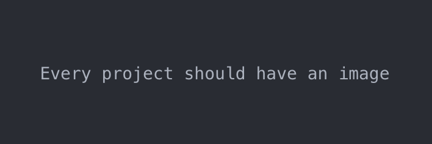

# Python3 project template


A simple template for python projects that can and should be dockerized. Created this repo since I more or less do the same procedure **every time** I create a new python API or dockerized repo. It includes pre-commit hooks cleaning up the code using `flake8`, `black` and `pre-commit`, and uses a `pre-push`-hook leveraging pytest for launching tests before every push.

Tools used:
- `virtualenv`
- pre-commit hooks
  - `pre-commit`. In the pre-commit:
    - `hadolint`
    - `black`
    - `flake8`
- `pre-push` hook: Simply a `pytest` used

## Resources important to understand

Package/tool | Description | Resources
-------------|-------------|----------
 `virtualenv`  | Create a virtual environment for package management. Activate using `source venv/bin/activate`, deactivate using `deactivate` in your terminal | [Documentation](https://docs.python.org/3/library/venv.html)
`pre-commit` | Tool used for creating pre-commit hooks. Before anything is committed, it needs to pass rules declared by you. | [Documentation](http://pre-commit.com/)
 `pytest` | Tool used to create tests. Run tests by simply typing `pytest` in the command line. | [Documentation](https://docs.pytest.org/en/stable/)
Docker | Docker is a tool to isolate an app and its applications into a state-less environment. Pretty nice. | [More info here](https://www.docker.com/)

## Configuration instructions

This was made on `python 3.7.7` and `pip3 20.0.2`.

## Installation instructions/Requirements

- `python3` and `pip3` are required.

If you decided to use this as a template for your own project, do the following:

### UNIX (MacOS or Linux)

1. Choose `Use this as template` on [the repo website](https://github.com/Filco306/python-project-template).
2. Run `source setup.sh` to set the repo up to be done.

### Windows

Honestly, I don't know. Currently, I believe this is pretty much only UNIX-compatible. If you have insights into development on a Windows-computer, feel free to add a PR to this Readme.

## Operating instructions

See installation instructions.

Generally, in the different folders, you put the following.

- `res`: Put resources such as images, data files etc.
- `src`: Put the source code here, with the entrypoint `index.py` being the exception.
- `test`: Put the tests here. These are run before push.

## A file manifest (list of files included)

```
python-project-template/
├── .dockerignore           # which files for docker to ignore
├── .env.example            # an example of which secrets needed for the repo.
├── .flake8                 # Declaring code rules
├── .gitignore
├── .pre-commit-config.yaml
├── Dockerfile
├── README.md
├── index.py
├── setup-folder
│   ├── Readme-template.md
│   └── pre-push
├── requirements.txt
├── res
│   └── img
│       └── fstimg.png
├── setup.sh
├── src
│   ├── __init__.py
│   └── run.py
└── test
    ├── __init__.py
    └── test_hello.py
```

Generated using `tree` (install it using `brew install tree`). To generate your own for you own project, use

``tree -a -I '*.pyc|__pycache__|.git|.pytest_cache' YOUR-REPO-NAME/``

## Copyright and licensing information

MIT License

Copyright (c) 2020 Filip Cornell

Permission is hereby granted, free of charge, to any person obtaining a copy
of this software and associated documentation files (the "Software"), to deal
in the Software without restriction, including without limitation the rights
to use, copy, modify, merge, publish, distribute, sublicense, and/or sell
copies of the Software, and to permit persons to whom the Software is
furnished to do so, subject to the following conditions:

The above copyright notice and this permission notice shall be included in all
copies or substantial portions of the Software.

THE SOFTWARE IS PROVIDED "AS IS", WITHOUT WARRANTY OF ANY KIND, EXPRESS OR
IMPLIED, INCLUDING BUT NOT LIMITED TO THE WARRANTIES OF MERCHANTABILITY,
FITNESS FOR A PARTICULAR PURPOSE AND NONINFRINGEMENT. IN NO EVENT SHALL THE
AUTHORS OR COPYRIGHT HOLDERS BE LIABLE FOR ANY CLAIM, DAMAGES OR OTHER
LIABILITY, WHETHER IN AN ACTION OF CONTRACT, TORT OR OTHERWISE, ARISING FROM,
OUT OF OR IN CONNECTION WITH THE SOFTWARE OR THE USE OR OTHER DEALINGS IN THE
SOFTWARE.

## Some other nice tricks

Say you have used this for a while and have several projects with this layout, but need to change all the

- Change all `.pre-commit-config.yaml` to a newer version existing on your laptop:
``find . -name ".pre-commit-config.yaml" -print -exec cp PATH_TO_NEW_FILE/.pre-commit-config.yaml {} \; ``
**WARNING: This will change all .pre-commit-config.yaml files in the folder you are in to the newer version. If you have other projects not from this template, I would perhaps not use this command.**

## Contact information for the distributor or programmer

[Filip Cornell](mailto:c.filip.cornell@gmail.com?subject=Regarding%20your%20awesome%20repo)

## Known bugs[3]

## Troubleshooting[3]

## Credits and acknowledgments

- The structure of this readme is fetched from [Wikipedia](https://en.wikipedia.org/wiki/README). Information retrieved 25/6 - 2020
- MIT license is fetched from [this site](https://choosealicense.com/licenses/mit/). Information retrieved 25/6 - 2020

## A changelog (usually for programmers)

## A news section (usually for users)

### Coming soon

A few ideas on how to improve this:
- Add parameters to the setup.
